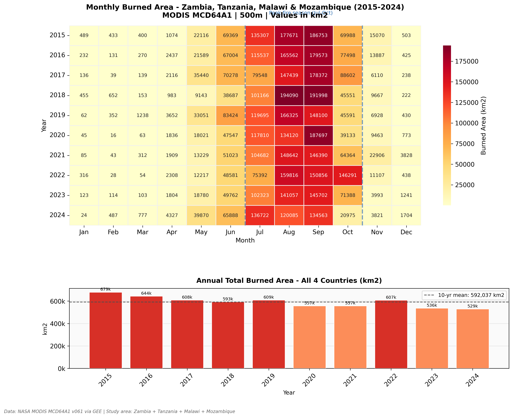
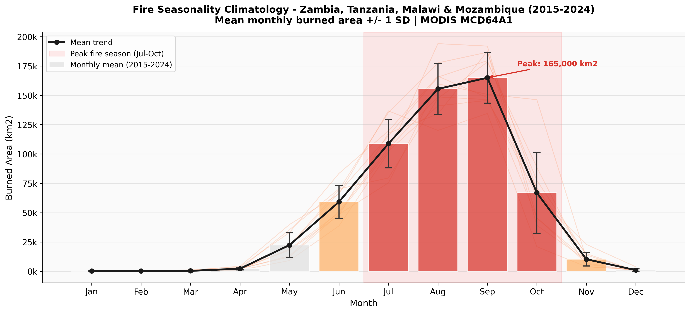
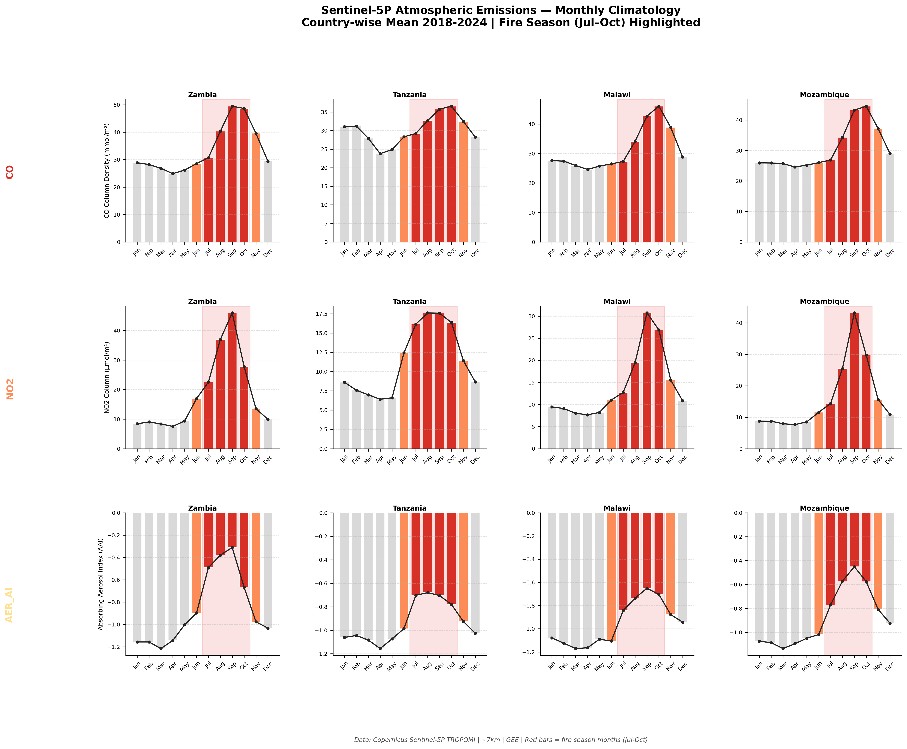
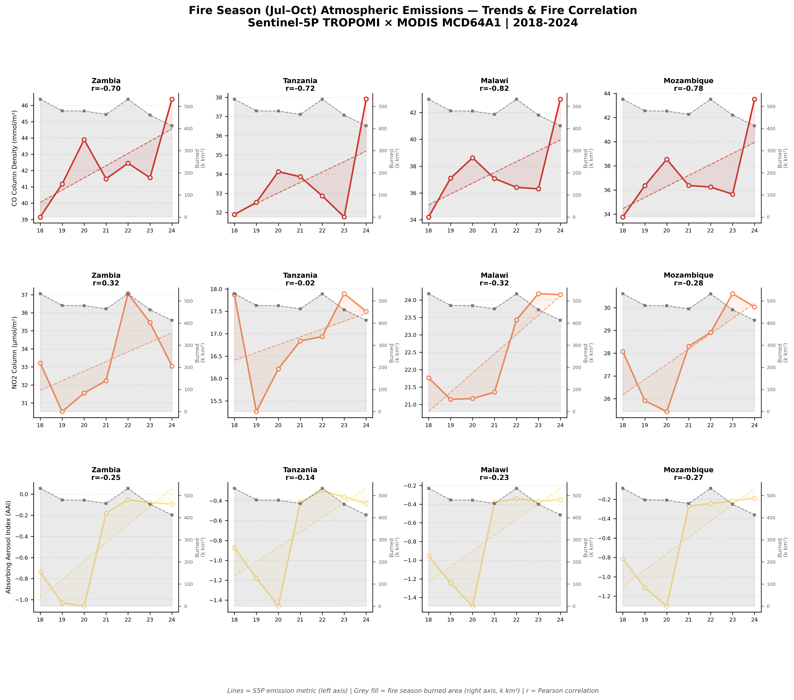
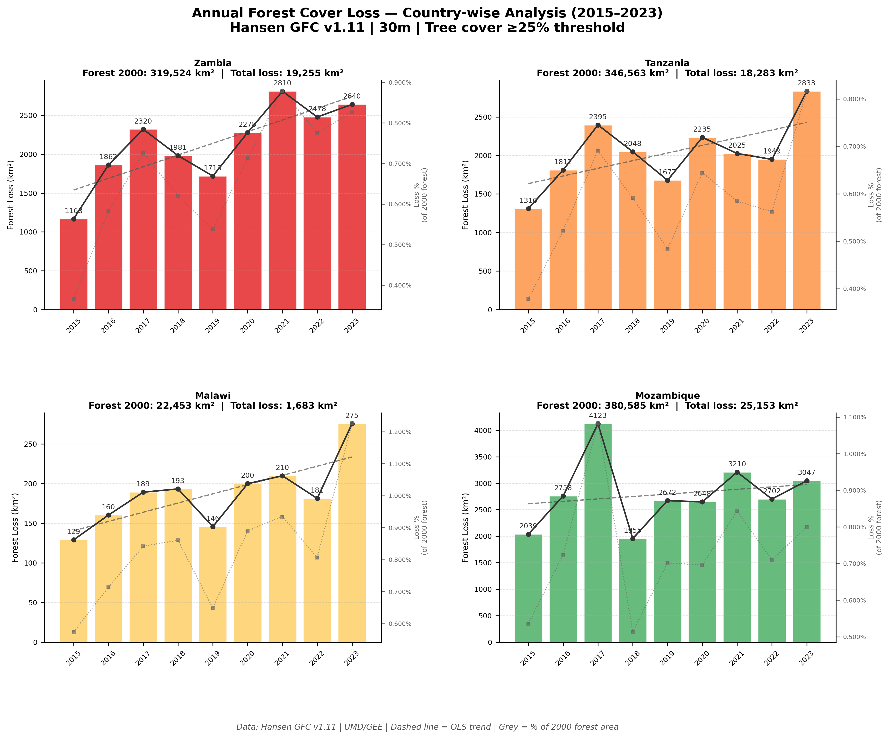
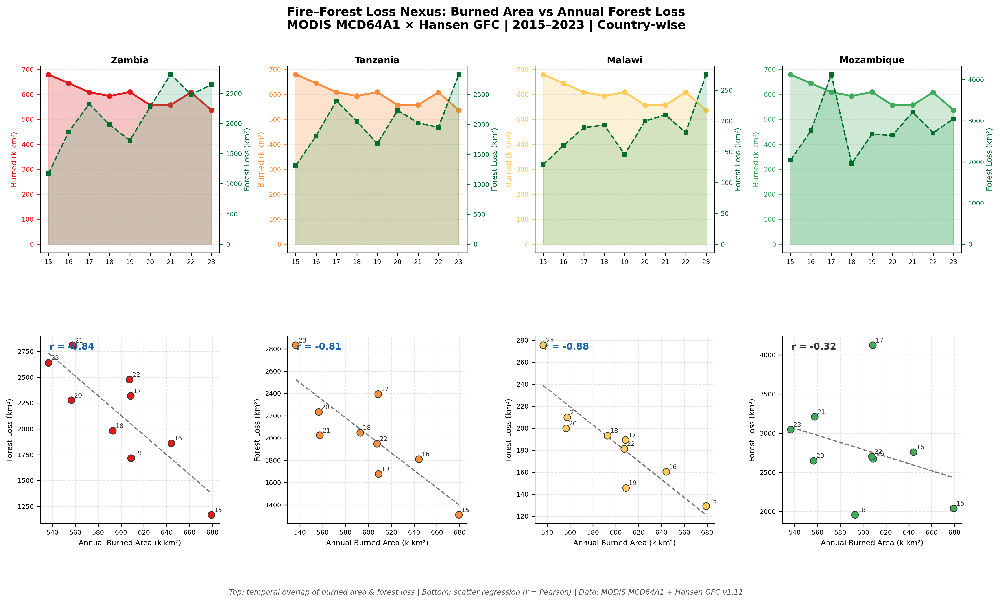

# Wildfire Dynamics, Atmospheric Emissions and Forest Cover Loss in Zambia, Tanzania, Malawi and Mozambique
## A Decadal Multi-Source Remote Sensing Analysis (2015-2024)

<p align="center">
  
  
  
  
  
  
  
</p>

<p align="center">
  <b>Study Area: </b> Zambia &nbsp;-&nbsp; Tanzania &nbsp;-&nbsp; Malawi &nbsp;-&nbsp; Mozambique
  &nbsp;&nbsp;|&nbsp;&nbsp;
  <b>Period:</b> 2015-2024 (Fire, Atmosphere) &nbsp;;&nbsp; 2015-2023 (Forest)
  &nbsp;&nbsp;|&nbsp;&nbsp;
  <b>Platform:</b> Google Earth Engine + Python
</p>

---

## 1. About This Project

This repository presents an integrated, reproducible remote sensing workflow that quantifies **wildfire seasonality**, **biomass burning atmospheric emissions**, and **forest cover loss** across four fire-active nations of southern-eastern Africa : Zambia, Tanzania, Malawi, and Mozambique over a decade of satellite observations.

The analysis fuses three independently validated satellite data streams:
- **MODIS MCD64A1**: 500m monthly burned area (2015–2024, 120 months)
- **Sentinel-5P TROPOMI** : CO, NO₂ and Absorbing Aerosol Index (2018–2024, 84 months)
- **Hansen Global Forest Change v1.11**: Annual 30m forest loss (2015–2023)

All data acquisition, analysis, visualisation, and interactive mapping are implemented in a single Google Colab notebook using the GEE Python API.

---

## 2. Key Statistics at a Glance

| Metric | Value |
|--------|-------|
| **10-year total burned area** | 5,920,370 km² (all 4 countries) |
| **Annual mean burned area** | 592,037 km²/year |
| **Peak fire month** | September : 165,000 km²/month average |
| **Core fire season** | July – October (>85% of annual burned area) |
| **CO–fire correlation** | r = −0.70 to −0.82 (Sentinel-5P vs MODIS) |
| **Cumulative forest loss** | 64,374 km² (2015–2023, all 4 countries) |
| **Highest forest loss** | Mozambique: 25,153 km² absolute |
| **Highest proportional loss** | Malawi: up to 1.22%/year of 2000 forest area |
| **Forest trend** | Rising OLS trend in all 4 countries |
| **Fire–forest nexus** | r = −0.84 (Zambia), −0.81 (Tanzania), −0.88 (Malawi) |

---
## 3. Interactive Web Map

> **The map is live : click the button below to explore it in your browser.**

<p align="center">
  <a href="https://ujjwalks96.github.io/Wildfire-Dynamics-SouthEastAfrica/outputs/maps/interactive_fire_heatmap.html">
    
  </a>
</p>

---

The map is a fully self-contained HTML file (`outputs/maps/interactive_fire_heatmap.html`) : no server required, works offline once downloaded.

**Map layers & controls:**
- **3 basemaps** : Esri Satellite Imagery, CartoDB Light, Dark Mode
- **11 HeatMap layers** : Cumulative 2015–2024 + individual year toggle (2015–2024)
- **GeoJSON overlays** : Study area boundaries (yellow) + neighbouring countries (dashed)
- **Controls** : Fullscreen, MiniMap, live coordinates, distance ruler

**6-Tab Analytics Panel** (pure SVG, zero CDN dependencies : works fully offline):

| Tab | Content |
|-----|---------|
| 📈 **Trend** | Annual bar chart + monthly climatology + 4 KPI cards |
| 🌍 **By Country** | Grouped bars per country + country summary cards |
| 📋 **Matrix** | Year × country burned area matrix (000 km²) |
| 🌫️ **Emissions** | CO / NO₂ / Aerosol Index country trends + fire-season KPIs |
| 🌳 **Forest** | Annual loss grouped bars + cumulative loss curves + summary cards |
| 🔍 **Findings** | 5 literature-validated key findings with citations |

**Preview:**
*↑ Static preview : [click here for the live interactive version](https://ujjwalks96.github.io/Wildfire-Dynamics-SouthEastAfrica/outputs/maps/interactive_fire_heatmap.html)*


---

## 4. Repository Structure

```
📦 Wildfire_Dynamics_SouthEastAfrica/
│
├── 📓 notebooks/
│   └── Wildfire_Dynamics_SouthEastAfrica.ipynb    ← Main analysis notebook (48 cells)
│
├── 📊 figures/
│   ├── fig1_seasonal_heatmap.png                  ← Monthly heatmap + annual totals
│   ├── fig2_fire_climatology.png                  ← 10-year fire seasonality climatology
│   ├── fig3_fire_by_landcover.png                 ← Fire frequency × IGBP land cover
│   ├── fig4_spatial_fire_map.png                  ← 10-year fire recurrence spatial map
│   ├── fig5_s5p_monthly_climatology.png           ← Sentinel-5P CO/NO₂/AAI climatology
│   ├── fig6_s5p_fire_correlation.png              ← Emission trends × fire correlation
│   ├── fig7_forest_loss_country.png               ← Hansen GFC annual country loss
│   └── fig8_fire_forest_correlation.png           ← Fire × forest loss nexus
│
│
├── 📁 data/
│   └── README.md                                  ← GEE data access guide + collection IDs
│
├── 📁 outputs/
│   └── maps/                                      ← Interactive Folium HTML map (generated)
│
├── requirements.txt
├── environment.yml
├── .gitignore
└── LICENSE
```

---

## 4. Datasets

| Dataset | GEE Collection ID | Band(s) Used | Resolution | Period |
|---------|------------------|--------------|------------|--------|
| **MODIS MCD64A1 v061** | `MODIS/061/MCD64A1` | `BurnDate` | 500 m | Jan 2015 – Dec 2024 |
| **MODIS MCD12Q1 v061** | `MODIS/061/MCD12Q1` | `LC_Type1` (IGBP) | 500 m | 2020 epoch |
| **Sentinel-5P CO** | `COPERNICUS/S5P/OFFL/L3_CO` | `CO_column_number_density` | ~7 km | Jan 2018 – Dec 2024 |
| **Sentinel-5P NO₂** | `COPERNICUS/S5P/OFFL/L3_NO2` | `tropospheric_NO2_column_number_density` | ~7 km | Jan 2018 – Dec 2024 |
| **Sentinel-5P AER_AI** | `COPERNICUS/S5P/OFFL/L3_AER_AI` | `absorbing_aerosol_index` | ~7 km | Jan 2018 – Dec 2024 |
| **Hansen GFC v1.11** | `UMD/hansen/global_forest_change_2023_v1_11` | `lossyear`, `treecover2000` | 30 m | Loss years 2015–2023 |
| **USDOS LSIB Simple 2017** | `USDOS/LSIB_SIMPLE/2017` | Boundaries | Vector | Reference |

> Forest mask applied: `treecover2000 ≥ 25%` (consistent with FAO forest definition)

---

## 5. Methodology

The workflow is structured across **12 notebook sections**:

```
Section  1 → Package installation + GEE authentication
Section  2 → AOI definition, time period, country list
Section  3 → MODIS burned area GEE extraction (500m, monthly) + raster export to GDrive
Section  4 → Seasonal statistics (climatology, annual totals, pivot matrix)
Section  5 → Figures 1–4: heatmap, climatology, land cover, spatial map
Section  6 → Google Drive mount + raster ingestion
Section  7 → Country-wise burned area extraction via LSIB boundaries
Section  8 → Sentinel-5P CO/NO₂/AER_AI extraction + Figures 5–6
Section  9 → Hansen GFC forest loss extraction + Figures 7–8
Section 10 → Interactive Folium map (6-tab analytics panel)
Section 11 → Summary report (text output)
Section 12 → ZIP export of all outputs
```

**Core technical choices:**
- `bestEffort=True` + appropriate `scale` parameters throughout to handle GEE memory limits
- S5P extracted at 7,000m (native TROPOMI resolution) using `mean` reducer
- Forest loss at 100m scale (upsampled from 30m) to balance precision and compute time
- Fire frequency raster: sum of 120 monthly burned binary masks → float32 export
- Land cover cross-tabulation via `rasterstats.zonal_stats()` locally after GDrive download
- Interactive map uses pure-SVG chart functions : zero CDN dependencies, works offline

---

## 6. Results & Figures

### Figure 1 : Monthly Fire Calendar & Annual Trends



**What it shows:** A 10-year heatmap (2015–2024) of monthly burned area across all four countries combined, with annual totals below. The colour scale runs from pale yellow (low) to deep red (>175,000 km²).

**Key finding:** Fire activity is tightly compressed into July–October, with September consistently the peak month. Annual totals show a structural decline after 2019 : from 679k km² (2015) to 529k km² (2024), a 22% reduction : consistent with agricultural expansion fragmenting fire landscapes rather than active fire suppression.

---

### Figure 2 : Fire Seasonality Climatology



**What it shows:** 10-year monthly climatology with mean ± 1 SD error bars, overlaid with individual year traces (light red). The peak annotation is placed automatically at the maximum mean month.

**Key finding:** September peaks at 165,000 km²/month across the study region. The SD bars are widest in August–September, indicating that peak fire season intensity : not onset timing : carries the greatest inter-annual uncertainty. June shows a narrower spread, suggesting more mechanistically constrained early-season ignition.

---

### Figure 3: Wildfire Dynamics Across Land Cover Types


**What it shows:** Dual horizontal bar chart : Panel A ranks IGBP land cover classes by mean fire frequency (months burned per pixel, 2015–2024); Panel B shows the proportion of each class's pixel extent burned at least once.

**Key finding:** **Every single land cover class shows 100% area-ever-burned.** No vegetation type escaped fire over the decade. Deciduous Broadleaf Forest (miombo woodland) leads with 4.0 months/pixel, followed by Savanna (4.4) and Mixed Forest (4.2). Even Cropland scores 3.4 months/pixel : a clear signal of deliberate post-harvest burning as a land management practice across all four countries.

---

### Figure 4: 10-Year Spatial Fire Recurrence Map


**What it shows:** Per-pixel fire frequency classified into five recurrence interval classes from Rare (1–2 months burned in 10 years) to Extreme (9+ months). Produced from a summed MODIS binary mask at 500m, overlaid on country boundaries.

**Key finding:** Central-western Zambia : particularly the Kafue Basin : forms the most persistently fire-active core, with large contiguous areas classified as Extreme or Very Frequent. Northern Tanzania's western Rift corridor shows patchy but intense recurrence. A clear west–east gradient reflects the Indian Ocean moisture influence reducing fire recurrence toward the coastal belt.

---

### Figure 5: Sentinel-5P Atmospheric Emissions Climatology



**What it shows:** A 3×4 grid: three atmospheric products (CO, NO₂, Absorbing Aerosol Index) × four countries : showing monthly climatology (mean across 2018–2024). Fire season months (Jul–Oct) are highlighted in red; pre/post-season in orange; background months in grey.

**Key finding:** All three atmospheric metrics peak coherently with the MODIS fire calendar across all four countries. CO peaks at 45–50 mmol/m² in Zambia and Malawi during August–October. The AAI shifts from strongly negative wet-season values (~−1.2) to less negative fire-season values (~−0.4), confirming absorbing black-carbon aerosol loading from biomass burning smoke. NO₂ shows higher month-to-month noise consistent with its shorter ~1–3 day atmospheric lifetime.

---

### Figure 6: Fire-Season Emission Trends and Fire Correlation



**What it shows:** Peak fire-season (Jul–Oct) annual emission trends per country, overlaid with burned area (grey fill, secondary axis). Pearson r values quantify the annual correlation between each emission metric and fire extent.

**Key finding:** CO column density shows **strong negative correlations** with burned area across all countries : Zambia (r = −0.70), Tanzania (r = −0.72), Malawi (r = −0.82), Mozambique (r = −0.78). This counterintuitive result reflects trans-boundary atmospheric transport: as within-region burned area declined post-2019, CO advected from the Congo Basin and Angola continued to load the atmospheric column, decoupling local fire extent from column-averaged CO. NO₂ correlations are weaker (r = −0.02 to +0.32) due to its short atmospheric lifetime preventing accumulation of an annual signal.

---

### Figure 7: Annual Forest Cover Loss by Country (Hansen GFC)



**What it shows:** Four-panel country-wise forest loss analysis (2015–2023), showing annual bars, OLS trend line, and secondary axis with loss expressed as percentage of 2000 forest area. Dashed grey line shows OLS trend direction.

**Key finding:** Forest loss is **rising in all four countries** : no country has reached a forest transition inflection point. Mozambique records the highest absolute cumulative loss (25,153 km²), with a dramatic 2017 peak (4,123 km²) likely associated with Cyclone Dineo impacts. Zambia shows the clearest accelerating trend, reaching 2,810 km² in 2021. Malawi, despite the smallest absolute loss (1,683 km²), shows the highest proportional rate : up to 1.22%/year of its 2000 forest estate.

---

### Figure 8: Fire × Forest Loss Nexus (MODIS × Hansen GFC)



**What it shows:** Two-row panel : top row shows temporal overlap of annual burned area (filled line, country colour) vs forest loss (green dashed line) for 2015–2023. Bottom row shows scatter plots with OLS regression and Pearson r.

**Key finding:** Forest loss correlates **strongly negatively** with burned area: Zambia (r = −0.84), Tanzania (r = −0.81), Malawi (r = −0.88), Mozambique (r = −0.32). The negative sign : years of lower burned area show higher forest loss : reflects the agricultural expansion mechanism: cropland conversion simultaneously reduces fire-prone savanna extent (lowering burned area) while deforesting woodland (increasing forest loss). Mozambique's weaker correlation is consistent with its more heterogeneous disturbance drivers including cyclone events and commercial logging.

---

## 8. Setup and Usage

### Prerequisites
- **Google Earth Engine account** (free for research): [signup.earthengine.google.com](https://signup.earthengine.google.com)
- **GEE project ID** : replace `ee-ujjwalkumarswainiirs1` in the notebook with your own
- **Google Drive** : for raster exports from GEE (Section 3)
- Recommended: **Google Colab Pro** (for longer GEE compute jobs)

### Option A : Google Colab (recommended)

```python
# Section 1 of the notebook handles all installations:
!pip install -q geemap earthengine-api geopandas rasterio rasterstats contextily folium
```

1. Upload `notebooks/Wildfire_Dynamics_SouthEastAfrica.ipynb` to Google Colab
2. Run Section 1 → installs all dependencies
3. Run Section 2 → GEE authentication (follow the auth URL)
4. Run sections in order : see recommended run sequence below

### Option B : Local Environment

```bash
git clone https://github.com/ujjwalks96/Wildfire_Dynamics_SouthEastAfrica.git
cd Wildfire_Dynamics_SouthEastAfrica
conda env create -f environment.yml
conda activate wildfire-sea
jupyter notebook notebooks/Wildfire_Dynamics_SouthEastAfrica.ipynb
```

### Recommended Run Sequence

```
Sections 1–5   →  Fire analysis, Figures 1–4           
Section  6     →  Mount Google Drive + copy rasters
Section  7     →  Country burned area extraction        
Section  8     →  Sentinel-5P extraction + Figs 5–6   
Section  9     →  Hansen GFC extraction + Figs 7–8     
Section  10    →  Interactive map  ← run AFTER 7, 8, 9 for all tabs
Sections 11–12 →  Summary report + ZIP export
```

> **Important:** Run Section 10 (Folium map) last : it checks for `s5p_dfs` and `df_forest` in scope. If run before Sections 8–9, Emissions and Forest tabs will show a placeholder message.

### Expected Outputs

| Output | Path | Size |
|--------|------|------|
| Monthly burned area time series | `data/processed/monthly_burned_area_2015_2024.csv` | ~5 KB |
| Country-wise burned area | `data/processed/country_burned_area.csv` | ~2 KB |
| S5P CO monthly values | `data/processed/s5p_co_country_2018_2024.csv` | ~15 KB |
| S5P NO₂ monthly values | `data/processed/s5p_no2_country_2018_2024.csv` | ~15 KB |
| S5P Aerosol Index | `data/processed/s5p_aer_ai_country_2018_2024.csv` | ~15 KB |
| Forest cover loss | `data/processed/forest_cover_loss_country_2015_2023.csv` | ~2 KB |
| Fire frequency raster | `data/raw/fire_frequency_2015_2024.tif` | ~120 MB |
| MODIS land cover raster | `data/raw/landcover_MODIS_2020.tif` | ~50 MB |
| Figures 1–8 (300 DPI PNG) | `outputs/figures/` | ~8 MB total |
| Interactive Folium map | `outputs/maps/interactive_fire_heatmap.html` | ~10–15 MB |
| Full ZIP export | `fire_atmosphere_forest_eastafrica.zip` | Auto-downloaded |

---

## 9. Code Highlights

### GEE Burned Area Extraction
```python
burned_collection = (
    ee.ImageCollection('MODIS/061/MCD64A1')
    .filterDate(START_DATE, END_DATE)
    .filterBounds(aoi)
    .select('BurnDate')
)

def get_burned_area_km2(image):
    burned_mask    = image.gt(0)
    pixel_area_km2 = ee.Image.pixelArea().divide(1e6)
    burned_area    = burned_mask.multiply(pixel_area_km2).reduceRegion(
        reducer    = ee.Reducer.sum(),
        geometry   = aoi,
        scale      = 500,
        maxPixels  = 1e13,
        bestEffort = True
    )
    return image.set({'burned_area_km2': burned_area.get('BurnDate'),
                      'system:time_start': image.get('system:time_start')})
```

### Sentinel-5P Country-wise Extraction
```python
S5P_PRODUCTS = {
    'CO':     {'collection': 'COPERNICUS/S5P/OFFL/L3_CO',
               'band': 'CO_column_number_density', 'scale_factor': 1e3},
    'NO2':    {'collection': 'COPERNICUS/S5P/OFFL/L3_NO2',
               'band': 'tropospheric_NO2_column_number_density', 'scale_factor': 1e6},
    'AER_AI': {'collection': 'COPERNICUS/S5P/OFFL/L3_AER_AI',
               'band': 'absorbing_aerosol_index', 'scale_factor': 1.0},
}

# Monthly mean per country per product at native 7km resolution
img = (ee.ImageCollection(col_id)
       .filterDate(f'{yr}-{mo:02d}-01', f'{yr}-{mo:02d}-31')
       .select(band)
       .mean())
result = img.reduceRegion(
    reducer=ee.Reducer.mean(), geometry=geom,
    scale=7000, maxPixels=1e10, bestEffort=True
)
```

### Hansen GFC Forest Loss per Country-Year
```python
gfc         = ee.Image('UMD/hansen/global_forest_change_2023_v1_11')
forest_mask = gfc.select('treecover2000').gte(25)   # FAO-consistent ≥25%
loss_yr     = gfc.select('lossyear')

for yr in range(2015, 2024):
    yr_code  = yr - 2000
    yr_mask  = loss_yr.eq(yr_code).And(forest_mask)
    area_img = yr_mask.multiply(ee.Image.pixelArea().divide(1e6))
    result   = area_img.reduceRegion(
        reducer=ee.Reducer.sum(), geometry=geom,
        scale=100, maxPixels=1e12, bestEffort=True
    )
```

---

## 10. Study Area Context

The study encompasses ~2.5 million km² across 25°E–40°E and 20°S–5°S:

| Country | Ecosystem | Fire Rank (global) | Forest 2000 (km²) |
|---------|-----------|---------------------|-------------------|
| **Zambia** | Miombo woodland, Savanna | 3rd (86.6% area burned, 2001–2020) | 319,524 |
| **Tanzania** | Miombo woodland, Montane forest | Top 5 | 346,563 |
| **Malawi** | Degraded woodland, Agricultural mosaic | : | 22,453 |
| **Mozambique** | Coastal savanna, Miombo | 4th (73.5% area burned) | 380,585 |


---
## 11. References

Giglio, L., Boschetti, L., Roy, D. P., Humber, M. L., & Justice, C. O. (2018). The Collection 6 MODIS burned area mapping algorithm and product. Remote Sensing of Environment, 217, 72–85. https://doi.org/10.1016/j.rse.2018.08.005

Hansen, M. C., Potapov, P. V., Moore, R., Hancher, M., Turubanova, S. A., Tyukavina, A., et al. (2013). High-resolution global maps of 21st-century forest cover change. Science, 342(6160), 850–853. https://doi.org/10.1126/science.1244693

Veefkind, J. P., Aben, I., McMullan, K., Förster, H., de Vries, J., Otter, G., et al. (2012). TROPOMI on the ESA Sentinel-5 Precursor: A GMES mission for global observations of the atmospheric composition. Remote Sensing of Environment, 120, 70–83. https://doi.org/10.1016/j.rse.2011.09.027

Gorelick, N., Hancher, M., Dixon, M., Ilyushchenko, S., Thau, D., & Moore, R. (2017). Google Earth Engine: Planetary-scale geospatial analysis for everyone. Remote Sensing of Environment, 202, 18–27. https://doi.org/10.1016/j.rse.2017.06.031

Boschetti, L., Roy, D. P., Giglio, L., Huang, H., Zubkova, M., & Humber, M. L. (2019). Global validation of the Collection 6 MODIS burned area product. Remote Sensing of Environment, 235, 111490. https://doi.org/10.1016/j.rse.2019.111490

NASA FIRMS (Fire Information for Resource Management System). (n.d.). Retrieved from https://firms.modaps.eosdis.nasa.gov

ESA Copernicus Sentinel-5P TROPOMI Data Portal. (n.d.). Retrieved from https://s5phub.copernicus.eu

Global Forest Watch. (n.d.). Hansen Global Forest Change Data Portal. Retrieved from https://www.globalforestwatch.org

---

## 12. Requirements

```
earthengine-api >= 0.1.370
geemap          >= 0.30.0
folium          >= 0.15.0
numpy           >= 1.24.0
pandas          >= 2.0.0
geopandas       >= 0.14.0
rasterio        >= 1.3.0
rasterstats     >= 0.19.0
matplotlib      >= 3.7.0
seaborn         >= 0.12.0
contextily      >= 1.4.0
Pillow          >= 10.0.0
scipy           >= 1.11.0
```

---

## 13. Topics

`remote-sensing` `google-earth-engine` `wildfire` `burned-area` `sentinel-5p` `modis` `hansen-gfc` `atmospheric-emissions` `forest-loss` `east-africa` `zambia` `tanzania` `malawi` `mozambique` `miombo` `python` `jupyter` `folium` `geospatial` `land-cover`

---

## 14. Author Deatils and Declaration

**Ujjwal Kumar Swain**
Geospatial AI Data & Policy Analyst, United Nations Population Fund (UNFPA) India, Odisha State Office
M.Sc. Geoinformation Science & Earth Observation : ITC, University of Twente / IIRS-ISRO

📧 [ujjwalks.iirs@gmail.com](mailto:ujjwalks.iirs@gmail.com) &nbsp;|&nbsp; Mobile no.: +917978641480

This repository presents an **independent preliminary research exercise** undertaken for portfolio purposes. All data used are publicly available satellite products (MODIS MCD64A1, Sentinel-5P TROPOMI, Hansen GFC) accessed via Google Earth Engine. While every effort has been made to ensure methodological rigour, any discrepancies, inaccuracies, or errors in data processing, analysis, or interpretation are the sole responsibility of the author.
---

## 15. License

This project is licensed under the **MIT License** : see [LICENSE](LICENSE) for details.

**Data licenses:**
- MODIS (MCD64A1, MCD12Q1): NASA Open Data Policy : public domain
- Sentinel-5P TROPOMI: Copernicus Open Access : CC BY 4.0
- Hansen GFC v1.11: Creative Commons Attribution 4.0 International
- USDOS LSIB: US Government : public domain

---

## 16. Citation

```bibtex
@misc{swain2026wildfire,
  author    = {Ujjwal Kumar Swain},
  title     = {Wildfire Dynamics, Atmospheric Emissions and Forest Cover Loss
               in Zambia, Tanzania, Malawi and Mozambique:
               A Decadal Multi-Source Remote Sensing Analysis (2015--2024)},
  year      = {2026},
  publisher = {GitHub},
  url       = {https://github.com/ujjwalks96/Wildfire_Dynamics_SouthEastAfrica}
}
```

---

*Data sources: NASA MODIS via GEE · Copernicus Sentinel-5P TROPOMI via GEE · Hansen GFC v1.11 via GEE · USDOS LSIB 2017*
